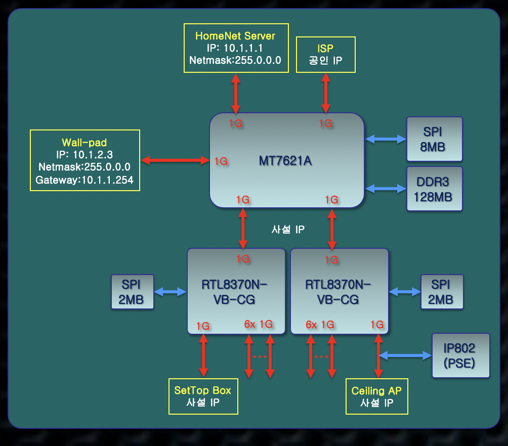

<!--프로젝트명  -->
# GitHub Project Control 

<!--타이틀  -->
Smart Router Project Kickoff

-HW Block diagram



<!-- 이미지 소스 패스 및 사이즈 지정  -->

<br>
-Test diagram
    


### 1. Features
- 프로젝트 메니저:
- 프록젝트 킥업 일자:
- 프로젝트 클로징 타겟 일자:
- 주요 일정 
    - 사양 검토
    - 회로 검토
    - 주요 발주 자재
    
        `pcb`, `main chip`, `flash memory`, `cable`
    
    - 자재 입고
    
       `pcb`, `main chip`, `flash memory`, `cable`

- 샘플 제작 착수 일자
- 샘플 제작 완료
    
   
- 샘플 테스트 결과

#### 1.1 성능
- 무선
- 유선
- 음성
- 부팅시간
-

#### 1.2 문제점
- 속도 안나옴
- 패킷로스 심함
- 재부팅


 
#### 1.3 디버깅
- 부품 교체
- 회로 수정
-

### 2. 샘플 버그 픽스
알려진 버그 전부 수정했으나 에이징을 통해 신뢰성 문제 추가 확인이 필요함  

<table>
<thead>
<tr>
<th align="center">Item</th>
<th align="center">wired</th>
<th align="center">wifi</th>
<th align="center">https</th>
<th align="center">reset</th>
<th align="center">igmp</th>
<th align="center">booting time</th>
<th align="center">drop test</th>
<th align="center">working temp</th>
</t
</thead>
<tbody>
<tr>
<td align="center"><sup>internal </sup></td>
<td align="center">-</td>
<td align="center"><sup>aa</sup><br><sup>aa</sup><br><sup>cc</sup><br><sup>acab</sup></td>
<td align="center"><sup>aa</sup><br><sup>11</sup></td>
<td align="center"><sup>gaa</sup><br><sup>aa</sup><br><sup>aab</sup><br><sup>aa</sup><br><sup>aa</sup><br><sup>dd</sup></td>
<td align="center"><sup>11</sup><br><sup>11</sup><br><sup>33</sup><br><sup>o22</sup><br><sup>22</sup><br><sup>22</sup><br><sup>22</sup><br><sup>22</sup><br><sup>22</sup><br><sup>22</sup></td>
<td align="center"><sup>dd</sup><br><sup>dd</sup><br><sup>dd</sup><br><sup>dd</sup><br><sup>dd</sup><br><sup>dd</sup><br><sup>dd</sup><br><sup>dd</sup><br><sup>dd</sup><br><sup>aa</sup><br><sup>dd</sup></td>
<td align="center"><sup>aa</sup><br><sup>dd</sup><br><sup>deed</sup><br><sup>dd</sup><br><sup>dbbd</sup><br><sup>dd</sup><br><sup>dd</sup><br><sup>dd</sup><br><sup>dd</sup><br><sup>aa</sup><br><sup>dd</sup></td>
<td align="center"><sup>dd</sup><br><sup>11</sup><br><sup>ss</sup><br><sup>ss</sup><br><sup>ss</sup><br><sup>ss</sup><br><sup>ee</sup><br><sup>ee</sup><br><sup>qq</sup><br><sup>qq</sup><br><sup>qq</sup><br><sup>qq</sup><br><sup>ss</sup><br><sup>ss</sup><br><sup>ee</sup><br><sup>ee</sup><br><sup>qq-amr</sup><br><sup>qq</sup><br><sup>q</sup><br><sup>qq</sup><br><sup>ee</sup><br><sup>ee</sup><br><sup>ee</sup><br><sup>vid.ee</sup><br><sup>ee</sup><br><sup>x264</sup><br><sup>qq</sup><br><sup>ee</sup></td>
</tr>
<tr>
<td align="center"><sup>test results</sup></td>
<td align="center" colspan=8><sup>conditional pass</sup><br><sup>not pass for wired</sup></td>
</tr>
<tr>
<td align="center"><sup>agig test</sup></td>
<td align="center" colspan=8><sup>heat</sup><br><sup>brabration</sup><br><sup>drop</sup><br><sup>humidity</sup></td>
</tr>
</tbody>
</table>

 - 최초 샘플 `유선`, `와이파이`, `에이징` 에 문제 있음 

 -  회로 수정후 개선됨

#### 2.1 중국 공장
1. Add MobileFFmpeg dependency to your `build.gradle` in `mobile-ffmpeg-<package name>` format
    ```
    공장 테스트 리포트 공유 {
         '문서 번호 : 2020200 xx 공유'
    }
    ```

2. 샘플 고객사 발송
    ```
    발송일자: 
    발송수량: 
    
    ```


#### 한국
1. 샘플 수령 

    - 일자
    ```
    '2020/03/05'
    ```

    - 수량
    ```
   '10 대'
    ```


### 3. Versions history 

`Smart hub` version number is aligned with `Smart hub` since version `1.0`. 
  
- `debug` part in `Smart hub version number indicates that `Smart hub` source is pulled from the `Smart hub` `bug` branch. 

|       Original Version | bugfix Version | bug fix Date |
| :----: | :----: |:----: |
| [1.0] | 1.0-debug-2020 | Jan 25, 2020 |
| [1.01]| 1.1-debug-2020 | Feb 25, 2020 |
| [1.2] | 1.2-debug-1181 |  Mar 27, 2019 |
